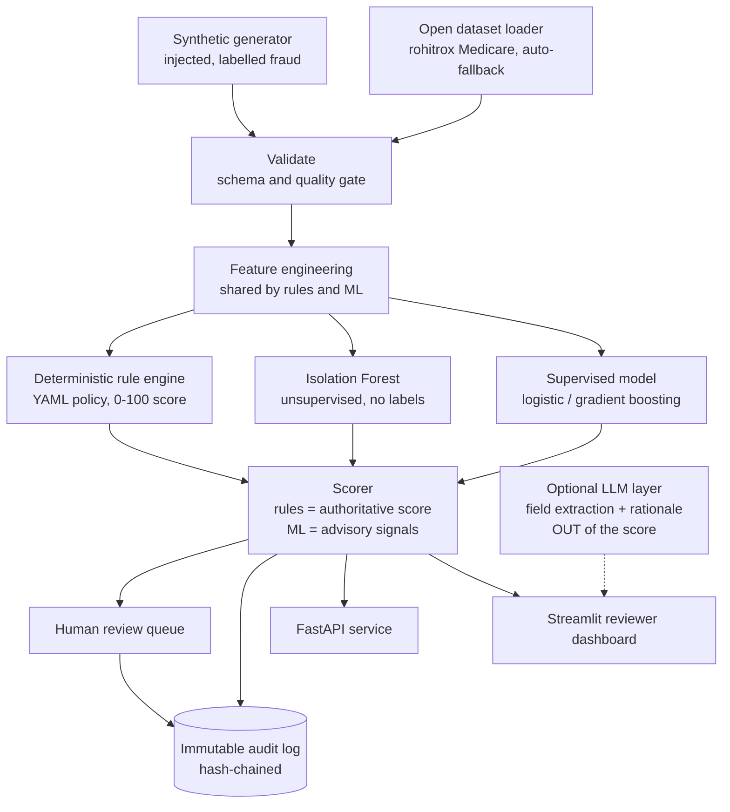

# ClaimGuard

An auditable, explainable insurance-claim fraud-detection proof of concept that runs end to end on **open-source or synthetic data only**, with **no real customer PII**. It is built for a conservative, risk-aware insurer: every score is deterministic and traceable, every decision is logged to a tamper-evident audit trail, and a human is always in the loop before any action.

[](https://github.com/Minifigures/data-project-rbc/actions/workflows/ci.yml)

## The problem

Manual claim review is slow and costly, and fraud losses are large. The catch for an applied-AI engineer is that you usually **cannot use real claims data** to build a detector: it contains personal information protected by privacy law (PIPEDA, Quebec Law 25) and model-governance rules (OSFI Guideline E-23). ClaimGuard is built around that constraint rather than ignoring it.

## Data strategy (the core idea)

When real data is off limits, the right move is a priority ladder:

1. **Open-source public datasets** when one fits the domain closely (here: the Kaggle "Healthcare Provider Fraud Detection Analysis" Medicare set, real ICD-10 / CPT codes and provider-level labels).
2. **Synthetic data** when no public set fits or you need control: a deterministic generator with injected, labelled fraud patterns and **zero PII by construction**.
3. **Rules plus unsupervised anomaly detection** with domain experts when there are no labels at all.

ClaimGuard ships both data sources behind one canonical schema, so they are interchangeable. With no Kaggle token present, the loader **falls back to synthetic automatically**, so the system always runs.

Privacy is structural, not a policy: the claim schema has **no field** for a name, address, date of birth, or any free-text PII. It cannot leak what it cannot store.

## Architecture



The same pipeline is **AWS-ready**: the deterministic scorer runs as an S3-triggered Lambda writing to DynamoDB (see `src/claimguard/aws/lambda_handler.py`), and works unchanged against a local emulator (LocalEmu / LocalStack) by pointing `AWS_ENDPOINT_URL` at `http://localhost:4566`. The full S3-to-Lambda-to-DynamoDB path is verified in CI against mocked AWS (moto), so the cloud handler is tested before any real deployment.

## The detection engine

Three layers, each earning its place:

- **Deterministic rules** (`detection/rules.py` + `policy.yaml`). Weights live in a YAML policy file with each weight justified by an NHCAA fraud typology, so a domain expert (not a developer) can tune them and every point of the 0-100 score traces to a named rule. This is the **authoritative, auditable** score.
- **Isolation Forest** (`detection/anomaly.py`). Unsupervised, needs no labels. This is the answer to "what if you have no labelled fraud at all?"
- **Supervised model** (`detection/supervised.py`). Logistic Regression (interpretable) or Gradient Boosting (higher recall), with class weighting for heavy imbalance.
- **Optional LLM layer** (`detection/llm_perception.py`). Extracts fields from a messy claim note and writes a plain-language rationale, but is kept **out of the numeric score** so scoring stays deterministic. Fully optional: with no `ANTHROPIC_API_KEY` it falls back to a deterministic template.

### Results (synthetic, held-out test set)

Fraud is rare, so accuracy is meaningless; we report precision / recall / F1 / PR-AUC.

| Model | Precision | Recall | F1 | PR-AUC |
|---|---|---|---|---|
| rules | 1.00 | 0.90 | 0.95 | 0.91 |
| isolation_forest | 0.53 | 0.58 | 0.56 | 0.65 |
| logistic | 1.00 | 0.99 | 0.996 | 0.996 |
| gradient_boosting | 1.00 | 1.00 | 1.00 | 1.00 |

**Read these honestly.** On synthetic data the rules look near-perfect because the injection and the rules were co-designed, and the supervised models approach perfect because the engineered features encode the injected signals. The genuinely informative results are (a) the supervised models recovering the **subtle** fraud the rules deliberately miss, and (b) the Isolation Forest scoring with **no labels at all**. The defensible production metric would come from the open-source labelled dataset, where the fraud was not designed by us.

## Auditability, privacy, and human-in-the-loop

- **Immutable audit log** (`api/audit.py`): every scoring event and human decision is appended to a **hash-chained** SQLite table. Altering any past record breaks the chain, and `verify_chain()` proves it. No PII is ever written.
- **Human review queue** (`api/review_queue.py`): the model never takes an adverse action on its own; it surfaces a scored, explained case for a person to approve, flag, or dismiss.
- **Fairness check** (`detection/fairness.py`): a four-fifths disparity statistic, demonstrated on a non-sensitive grouping (the schema has no protected attributes by design).

## Quickstart

```bash
# 1. Environment (uv is fast and needs no system python-venv)
uv venv .venv
VIRTUAL_ENV=.venv uv pip install -r requirements-dev.txt
VIRTUAL_ENV=.venv uv pip install -e .

# 2. Train + compare the models (writes models/ and logs to MLflow ./mlruns)
.venv/bin/python -m claimguard.mlops.train --n 8000 --seed 42

# 3. Run the end-to-end scoring pipeline (ingest -> validate -> score -> store -> audit)
.venv/bin/python -m claimguard.pipeline.run_pipeline --source synthetic --n 5000

# 4. API (http://localhost:8000/docs)
.venv/bin/uvicorn claimguard.api.main:app --reload
# then: curl -X POST localhost:8000/score -H 'content-type: application/json' -d @sample_data/example_claim_fraud.json

# 5. Reviewer dashboard
.venv/bin/streamlit run src/claimguard/dashboard/app.py

# 6. Tests + lint
.venv/bin/pytest --cov=claimguard
.venv/bin/ruff check src tests
```

To use the open dataset instead of synthetic, set a Kaggle token (`KAGGLE_USERNAME` / `KAGGLE_KEY`) and run with `--source open`. Without a token it falls back to synthetic.

## Project layout

```
src/claimguard/
  data/        schema (PII-free contract), synthetic generator, open-dataset loader
  pipeline/    feature engineering, validation gate, storage (sqlite/parquet, S3-ready), runner
  detection/   rules + policy.yaml, anomaly, supervised, scorer, fairness, optional LLM
  api/         FastAPI app, immutable audit log, human review queue
  aws/         S3-triggered Lambda handler (DynamoDB audit), endpoint-configurable
  mlops/       MLflow training + model comparison, metrics
  dashboard/   Streamlit reviewer UI
tests/         unit + integration (42 tests, incl. mocked-AWS Lambda path)
```

## Honest limitations

- The headline metrics are on synthetic data; production numbers require the open labelled dataset.
- The rule thresholds are tuned to the synthetic schema; on the open dataset the supervised model carries more of the load (there is no fee-guide column to compute fee ratios from).
- This is a one-day POC. A production deployment would add encryption at rest, VPC isolation, CloudTrail, a formal PII classification review, and model-governance sign-off under OSFI E-23.

## License

MIT (code). Sample data is synthetic and contains no personal information.
